# 📖 Panduan Pengguna YT-Short-Clipper

Panduan lengkap untuk menggunakan YT-Short-Clipper bagi pemula.

---

## 📑 Daftar Isi

- [1. Download & Instalasi](#1-download--instalasi)
  - [1.1 Download dari GitHub](#11-download-dari-github)
  - [1.2 Extract dan Jalankan](#12-extract-dan-jalankan)
- [2. Setup Library (yt-dlp, FFmpeg & Deno)](#2-setup-library-yt-dlp-ffmpeg--deno)
- [3. Setup Cookies YouTube](#3-setup-cookies-youtube)
  - [3.1 Install Extension Browser](#31-install-extension-browser)
  - [3.2 Export Cookies](#32-export-cookies)
  - [3.3 Upload Cookies ke Aplikasi](#33-upload-cookies-ke-aplikasi)
- [4. Membuat API Key di YT Clip AI (Rekomendasi)](#4-membuat-api-key-di-yt-clip-ai-rekomendasi)
  - [4.1 Login dengan Google](#41-login-dengan-google)
  - [4.2 Top Up Balance](#42-top-up-balance)
  - [4.3 Buat API Key](#43-buat-api-key)
- [5. Konfigurasi AI API](#5-konfigurasi-ai-api)
  - [5.1 Buka AI API Settings](#51-buka-ai-api-settings)
  - [5.2 Pilih Modul AI](#52-pilih-modul-ai)
  - [5.3 Pilih AI Provider](#53-pilih-ai-provider)
  - [5.4 Masukkan API Key & Load Models](#54-masukkan-api-key--load-models)
  - [5.5 Validasi & Simpan](#55-validasi--simpan)
- [6. Mulai Menggunakan Aplikasi](#6-mulai-menggunakan-aplikasi)
- [7. Google Drive Auto-Upload (Opsional)](#7-google-drive-auto-upload-opsional)
  - [7.1 Download & Letakkan rclone](#71-download--letakkan-rclone)
  - [7.2 Konfigurasi rclone (lakukan sekali)](#72-konfigurasi-rclone-lakukan-sekali)
  - [7.3 Verifikasi Koneksi](#73-verifikasi-koneksi)
  - [7.4 Aktifkan di Aplikasi](#74-aktifkan-di-aplikasi)
  - [7.5 Struktur Folder di Google Drive](#75-struktur-folder-di-google-drive)

---

## 1. Download & Instalasi

### 1.1 Download dari GitHub

1. Buka halaman GitHub YT-Short-Clipper
2. Klik menu **"Releases"** di sidebar kanan

   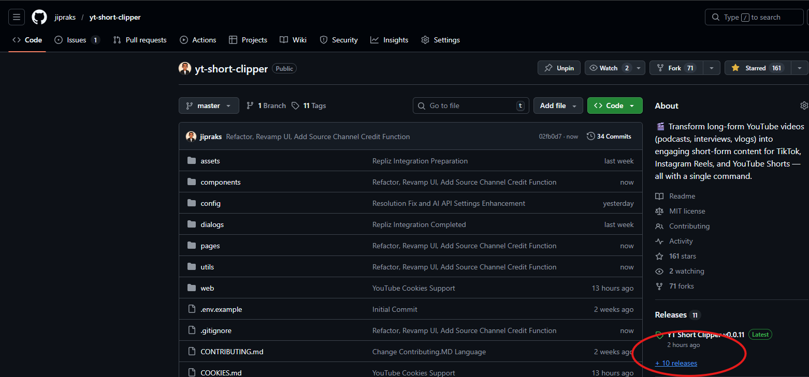

3. Pada halaman Releases, cari file dengan ekstensi `.exe` dan klik untuk download

   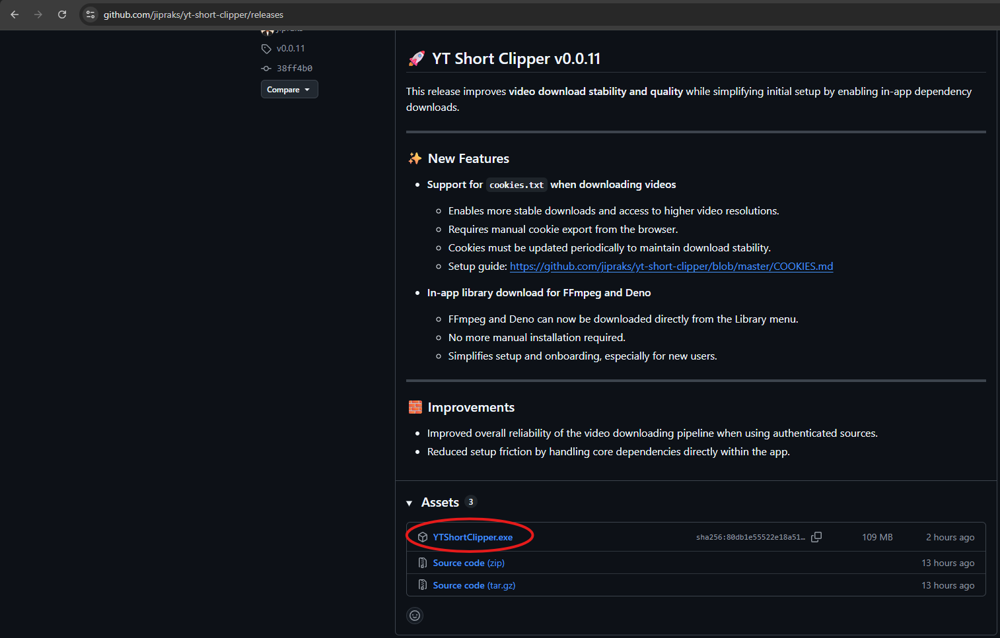

### 1.2 Jalankan Aplikasi

1. Setelah download selesai, double-click file `.exe` untuk menjalankan aplikasi
2. Jika muncul peringatan Windows Defender, klik **"More info"** → **"Run anyway"**

---

## 2. Setup Library (yt-dlp, FFmpeg & Deno)

Aplikasi membutuhkan library tambahan untuk download dan proses video.

1. Saat pertama kali membuka aplikasi, klik tombol **"Library"** di pojok kanan atas

   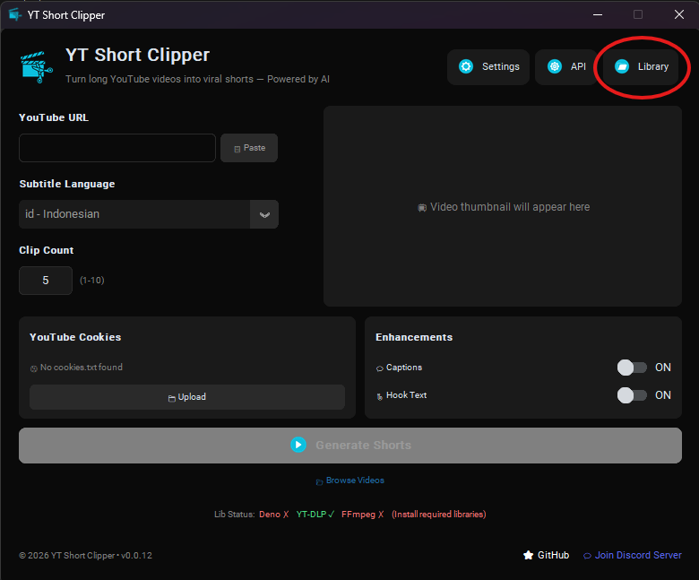

2. Klik tombol **"Download"** untuk mengunduh library yang diperlukan

   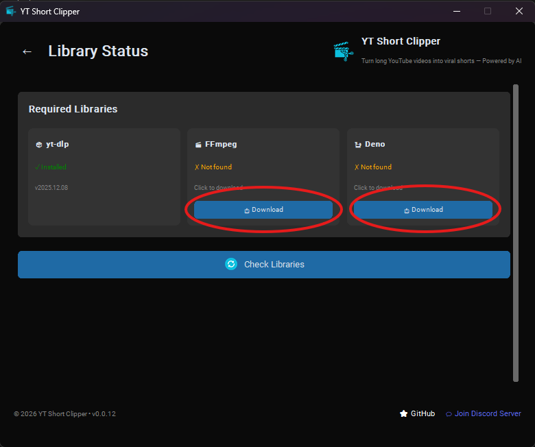

3. Tunggu proses download selesai

   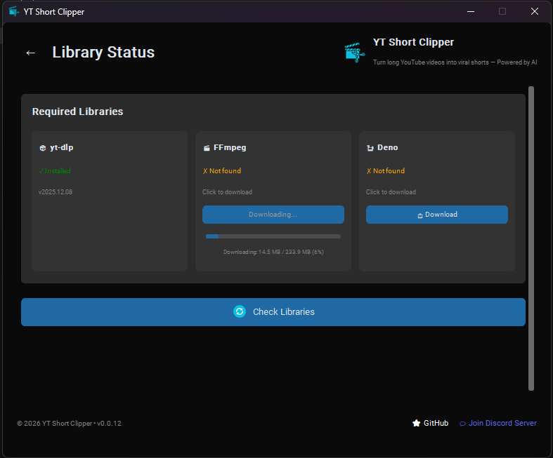

4. Setelah selesai, status akan berubah menjadi ✅ **Installed**
5. **Restart aplikasi** setelah semua library terinstall

---

## 3. Setup Cookies YouTube

Cookies diperlukan agar aplikasi bisa mengakses video YouTube atas nama kamu.

### 3.1 Install Extension Browser

1. Buka browser Chrome/Edge
2. Install extension **"Get cookies.txt LOCALLY"**:
   - [Download untuk Chrome/Edge](https://chromewebstore.google.com/detail/get-cookiestxt-locally/cclelndahbckbenkjhflpdbgdldlbecc)

### 3.2 Export Cookies

1. Buka [youtube.com](https://youtube.com) dan **pastikan sudah login**
2. Klik icon extension di toolbar browser

   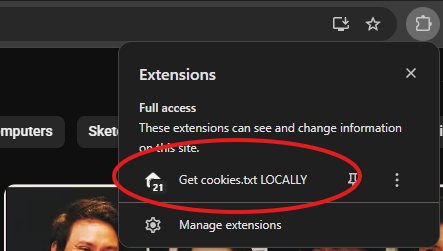

3. Klik **"Export"** untuk menyimpan cookies

   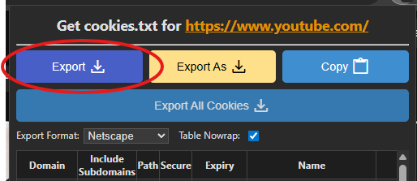

4. Simpan file sebagai `cookies.txt`

### 3.3 Upload Cookies ke Aplikasi

1. Di halaman utama aplikasi, klik tombol **"Upload Cookies"**

   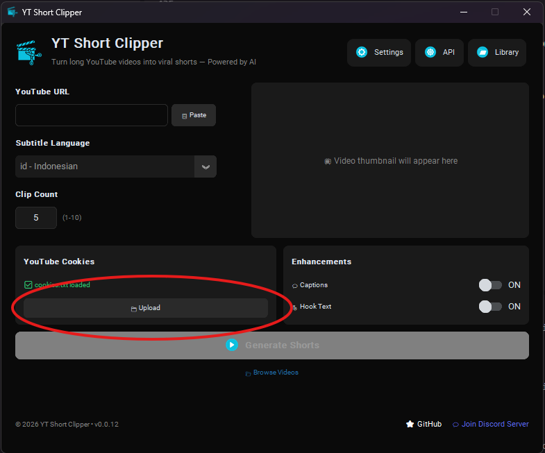

2. Pilih file `cookies.txt` yang sudah di-export
3. Status cookies akan berubah menjadi ✅ **Valid**

> **⚠️ Penting:** 
> - Cookies YouTube biasanya expired dalam 1-2 minggu
> - Jika muncul error autentikasi, export ulang cookies dari browser
> - Jangan pernah share file cookies.txt ke orang lain

---

## 4. Membuat API Key di YT Clip AI (Rekomendasi)

**YT Clip AI** adalah AI provider yang direkomendasikan karena harga lebih terjangkau dan sudah dioptimasi untuk aplikasi ini.

### 4.1 Login dengan Google

1. Buka [https://ai.ytclip.org](https://ai.ytclip.org)
2. Klik **"Login with Google"** dan pilih akun Google kamu

   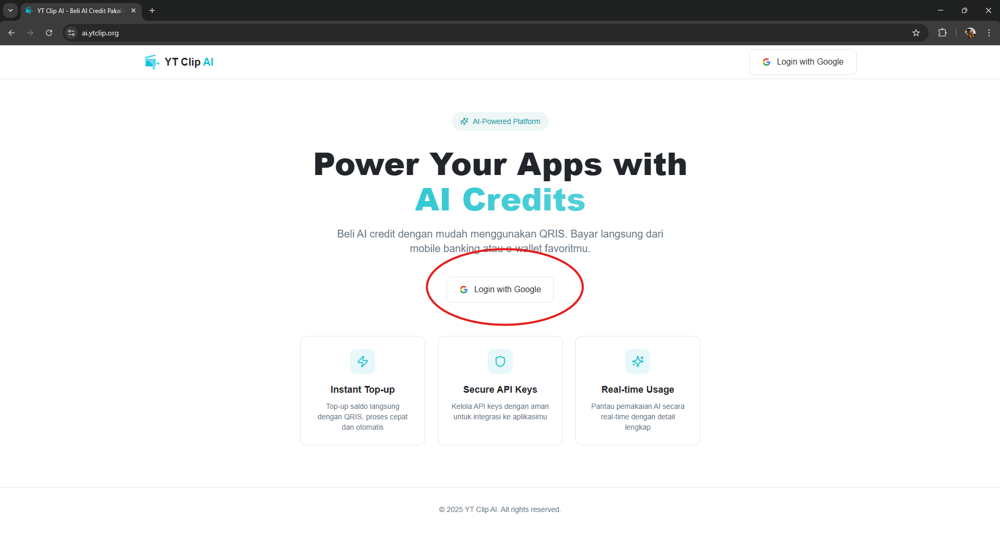

### 4.2 Top Up Balance

1. Setelah login, klik tombol **"Top Up"** untuk menambah saldo

   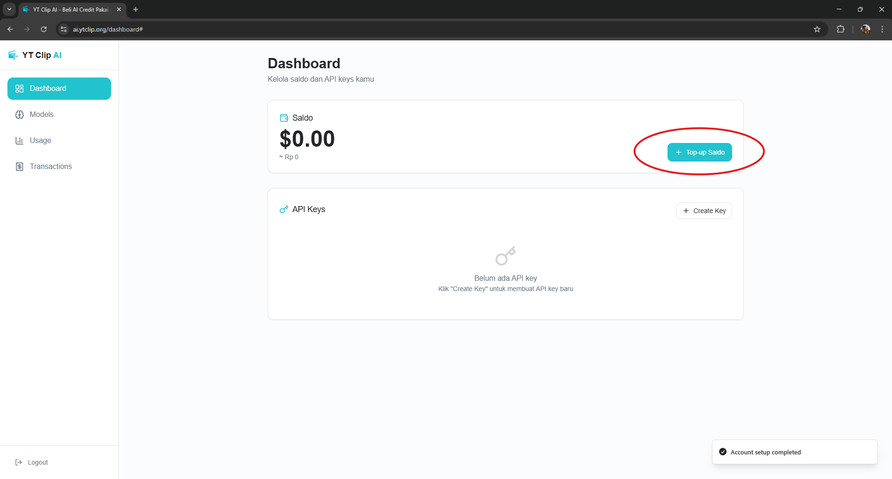

2. Masukkan jumlah top up yang diinginkan (dalam USD), akan terlihat konversi ke IDR

   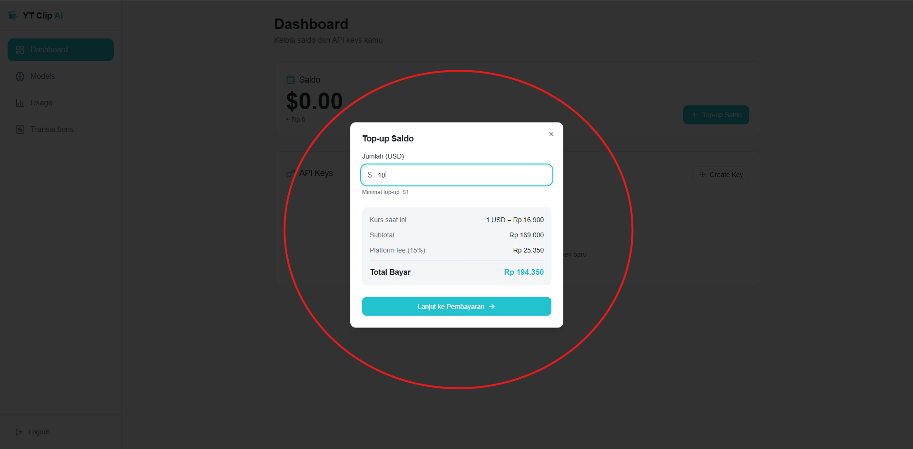

3. Bayar menggunakan **QRIS**

   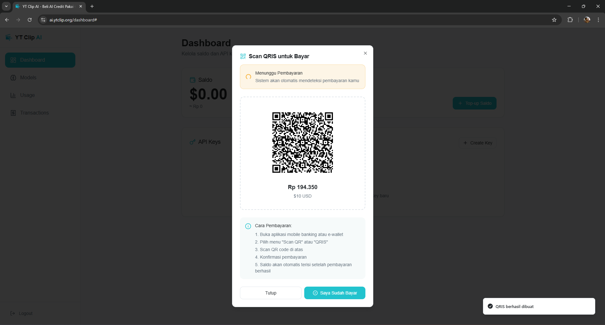

4. Setelah pembayaran berhasil, saldo USD akan langsung masuk secara realtime

### 4.3 Buat API Key

1. Setelah saldo terisi, klik tombol **"Create Key"**

   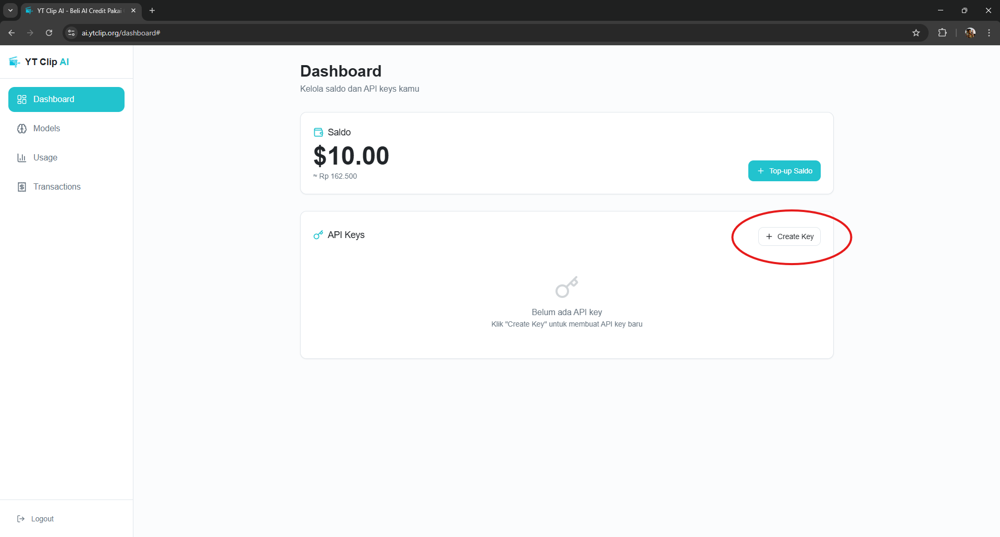

2. Isi nama untuk API Key kamu, lalu klik **"Create"**

   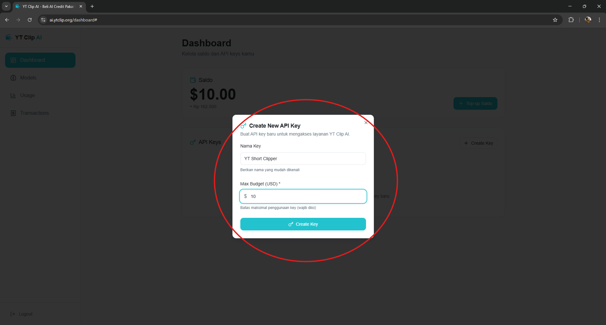

3. **Copy Secret Key** yang muncul dan simpan di tempat aman

   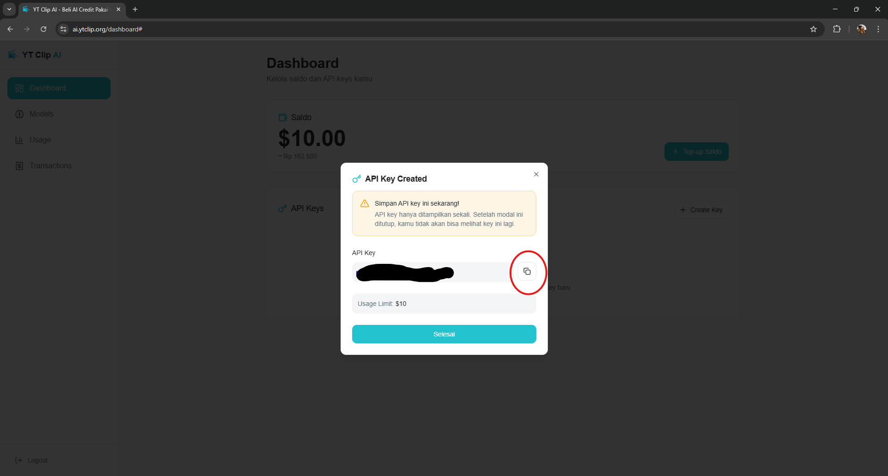

> **⚠️ Penting:** Secret Key hanya ditampilkan sekali! Pastikan sudah di-copy sebelum menutup dialog.

Setelah mendapatkan API Key, lanjut ke [Konfigurasi AI API](#5-konfigurasi-ai-api) untuk memasukkan key ke aplikasi.

---

## 5. Konfigurasi AI API

Aplikasi membutuhkan API Key untuk mengakses layanan AI (GPT, Whisper, TTS).

### 5.1 Buka AI API Settings

1. Klik tombol **Settings** (⚙️) di pojok kanan atas
2. Pilih menu **"AI API Settings"**

   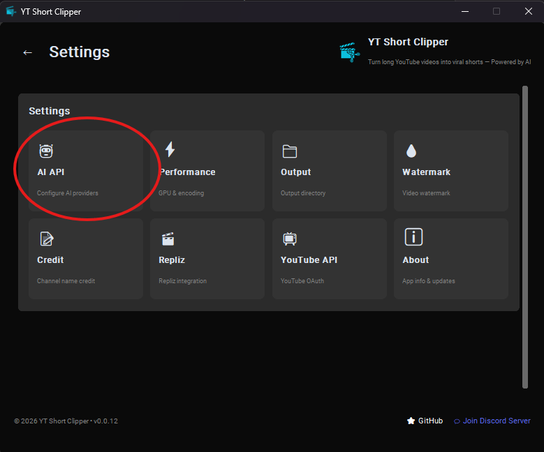

### 5.2 Pilih Modul AI

Aplikasi memiliki beberapa modul AI yang bisa dikonfigurasi secara terpisah:

   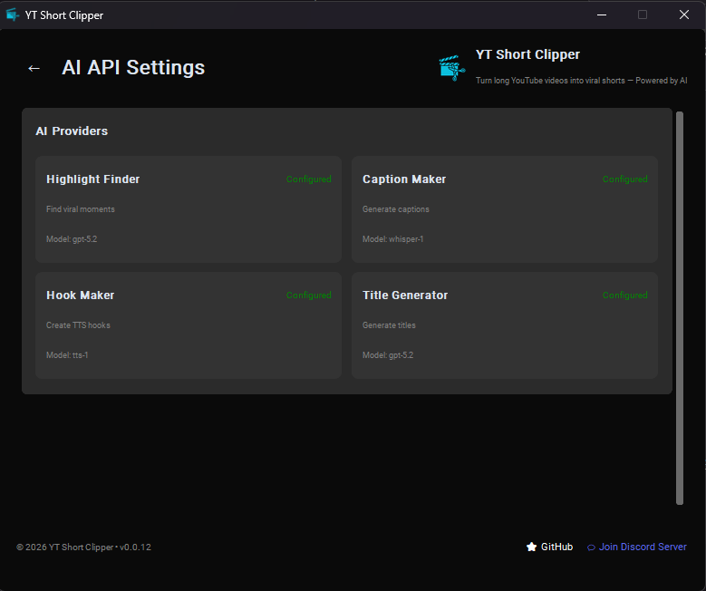

- **Highlight Finder** - Mencari momen menarik dari video
- **Caption Maker** - Membuat caption/subtitle
- **Hook Maker** - Membuat hook text untuk intro
- **Title Generator** - Generate judul & deskripsi SEO

### 5.3 Pilih AI Provider

1. Klik dropdown **"AI Provider"**
2. Pilih provider yang kamu punya API key-nya:
   - **YT CLIP AI** - [https://ai.ytclip.org](https://ai.ytclip.org)
   - **OpenAI** - [https://platform.openai.com](https://platform.openai.com)
   - **Custom** - Pakai provider lain

   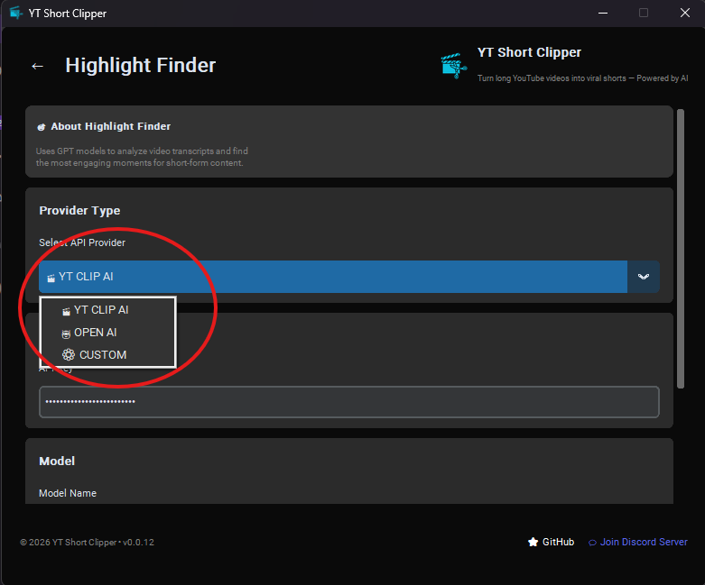

3. URL akan otomatis terisi sesuai provider yang dipilih

### 5.4 Masukkan API Key & Load Models

1. Paste **API Key** kamu di field yang tersedia
2. Klik tombol **"Load Models"** untuk mengambil daftar model

   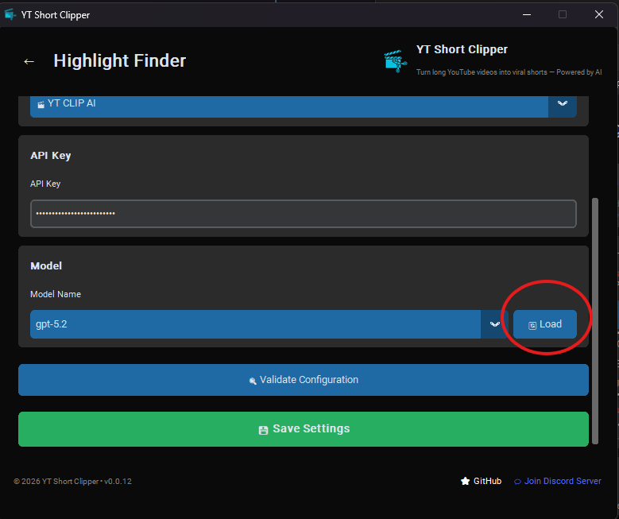

3. Pilih model yang ingin digunakan dari dropdown

   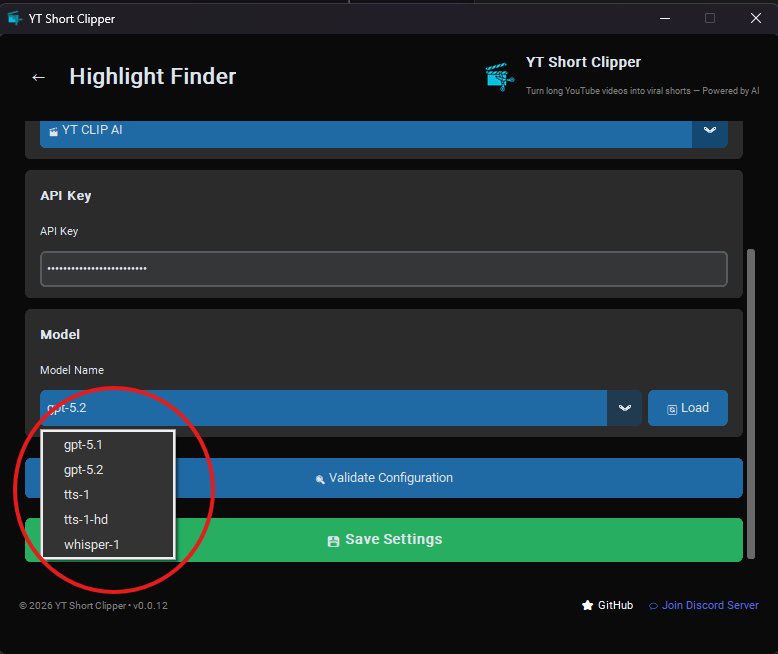

### 5.5 Validasi & Simpan

1. Klik tombol **"Validate"** untuk memastikan konfigurasi benar
2. Jika valid, klik **"Save"** untuk menyimpan

   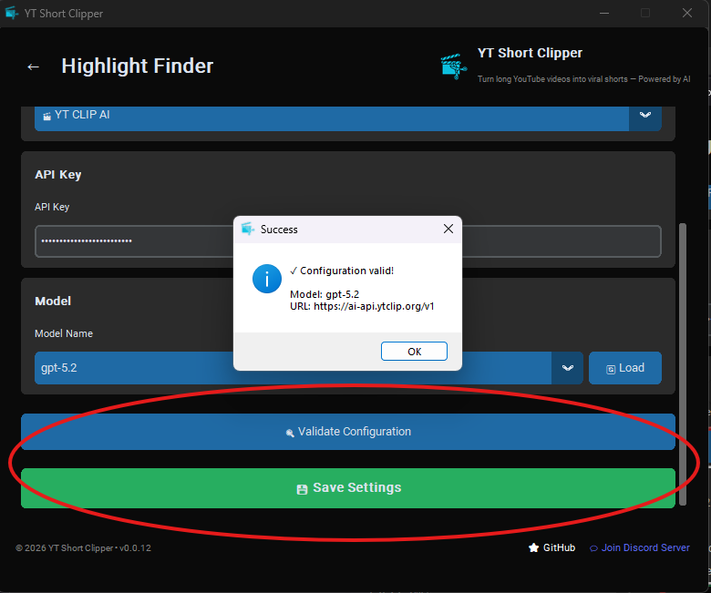

> **💡 Tips:** Ulangi langkah 5.2 - 5.5 untuk setiap modul AI yang ingin dikonfigurasi.

---

## 6. Mulai Menggunakan Aplikasi

Setelah semua setup selesai, kamu bisa mulai menggunakan aplikasi:

1. **Paste URL YouTube** yang ingin diproses
2. **Atur jumlah clips** yang diinginkan
3. **Klik "Start Processing"** dan tunggu hasilnya

Hasil clips akan tersimpan di folder `output/` dalam folder aplikasi.

### Struktur Output Per Clip

Setiap clip disimpan dalam folder dengan nama yang jelas:

```
output/
└── 20240603-clip01-nama-judul-clip/
    ├── master.mp4      ← video final 9:16
    ├── data.json       ← metadata lengkap (judul, hook, transcript, dll)
    └── content.txt     ← ringkasan teks yang bisa dibaca tanpa memutar video
```

---

## 7. Google Drive Auto-Upload (Opsional)

Aplikasi bisa otomatis menyimpan hasil clip ke Google Drive setelah selesai diproses.  
Fitur ini menggunakan **rclone** sebagai backend — tidak membutuhkan coding, tidak membutuhkan `client_secret.json`.

---

### 7.1 Download & Letakkan rclone

1. Buka halaman download rclone: [https://rclone.org/downloads/](https://rclone.org/downloads/)
2. Download versi **Windows — AMD64** (file `.zip`)

   > Contoh nama file: `rclone-v1.xx.x-windows-amd64.zip`

3. Extract file zip tersebut
4. Salin file **`rclone.exe`** ke folder yang sama dengan `YTShortClipper.exe`

   ```
   dist/
   ├── YTShortClipper.exe
   └── rclone.exe        ← letakkan di sini
   ```

---

### 7.2 Konfigurasi rclone (lakukan sekali)

1. Buka **Command Prompt** atau **PowerShell** di folder yang berisi `rclone.exe`

   > Cara cepat: di File Explorer, klik address bar, ketik `cmd`, lalu Enter

2. Jalankan perintah berikut:

   ```
   rclone.exe config
   ```

3. Akan muncul menu seperti berikut — ketik **`n`** lalu Enter untuk membuat remote baru:

   ```
   No remotes found, make a new one?
   n) New remote
   q) Quit config
   n/q> n
   ```

4. **Beri nama remote** → ketik **`gdrive`** lalu Enter (harus tepat, huruf kecil semua):

   ```
   name> gdrive
   ```

5. **Pilih tipe storage** → cari nomor untuk **Google Drive** dan ketik nomornya, lalu Enter:

   ```
   Storage> drive
   ```

   > Atau ketik kata `drive` langsung — rclone akan mencocokkan otomatis.

6. **client_id** → kosongkan, langsung Enter:

   ```
   client_id>
   ```

7. **client_secret** → kosongkan, langsung Enter:

   ```
   client_secret>
   ```

8. **scope** → ketik **`1`** (drive — akses penuh) lalu Enter:

   ```
   scope> 1
   ```

9. **root_folder_id** → kosongkan, langsung Enter:

   ```
   root_folder_id>
   ```

10. **service_account_file** → kosongkan, langsung Enter:

    ```
    service_account_file>
    ```

11. **Edit advanced config?** → ketik **`n`** lalu Enter:

    ```
    Edit advanced config? (y/n)> n
    ```

12. **Use auto config?** → ketik **`y`** lalu Enter:

    ```
    Use auto config? (y/n)> y
    ```

    Browser akan otomatis terbuka. **Login dengan akun Google** yang memiliki akses ke folder Drive tujuan, lalu klik **"Allow"**.

13. Setelah browser menampilkan "Success!", kembali ke terminal.

14. **Configure this as a Shared Drive (Team Drive)?** → ketik **`n`** lalu Enter:

    ```
    Configure this as a Shared Drive (Team Drive)? (y/n)> n
    ```

15. Konfirmasi konfigurasi dengan mengetik **`y`** lalu Enter:

    ```
    Keep this "gdrive" remote? (y/n)> y
    ```

16. Ketik **`q`** lalu Enter untuk keluar dari config:

    ```
    q) Quit config
    e/n/d/r/c/s/q> q
    ```

---

### 7.3 Verifikasi Koneksi

Pastikan rclone berhasil terhubung ke Google Drive. Buka cmd di folder yang berisi `rclone.exe`, lalu jalankan:

```
.\rclone.exe ls gdrive:/
```

Jika berhasil, akan tampil daftar file/folder di root Google Drive kamu.  
Jika muncul error, ulangi langkah 7.2 dari awal.

---

### 7.4 Aktifkan di Aplikasi

Setelah rclone terkonfigurasi, aktifkan fitur upload di aplikasi:

1. Buka aplikasi **YTShortClipper.exe**
2. Di halaman utama, cari dropdown **"Simpan ke"** (ada di samping tombol Upload Cookies)
3. Pilih salah satu opsi:
   - **Local** — hanya simpan ke komputer (default)
   - **Google Drive** — hanya upload ke Drive (tidak simpan lokal)
   - **Local + Google Drive** — simpan ke komputer sekaligus upload ke Drive

   > Pilih **"Local + Google Drive"** jika ingin backup otomatis.

4. Klik **"Find Highlights"** seperti biasa — upload ke Drive akan berjalan otomatis setelah setiap clip selesai diproses.

---

### 7.5 Struktur Folder di Google Drive

Hasil clip akan tersimpan dengan struktur berikut di Google Drive:

```
Google Drive/
└── AI Clipper/
    └── 2026/
        └── 06/
            └── 18/
                └── Judul-Video-YouTube/
                    ├── Clip 01 — Nama Highlight
                    │   ├── master.mp4
                    │   ├── data.json
                    │   └── content.txt
                    └── Clip 02 — Nama Highlight
                        └── ...
```

Struktur dibuat otomatis berdasarkan **tahun/bulan/tanggal/judul video** — mudah dicari dan rapi.

---

> **💡 Tips:**
> - File `rclone.exe` harus selalu berada di folder yang sama dengan `YTShortClipper.exe`
> - Login Google hanya perlu dilakukan **sekali** — credentials disimpan otomatis oleh rclone
> - Jika ganti akun Google, jalankan ulang `rclone.exe config` dan hapus remote `gdrive` yang lama, lalu buat ulang

---

## ❓ Butuh Bantuan?

- 🔑 [Dapatkan API Key AI di sini](https://ai.ytclip.org)
- 💬 Gabung [Discord Community](https://s.id/ytsdiscord) untuk tanya jawab, laporan bug, dan diskusi dengan pengguna lain
